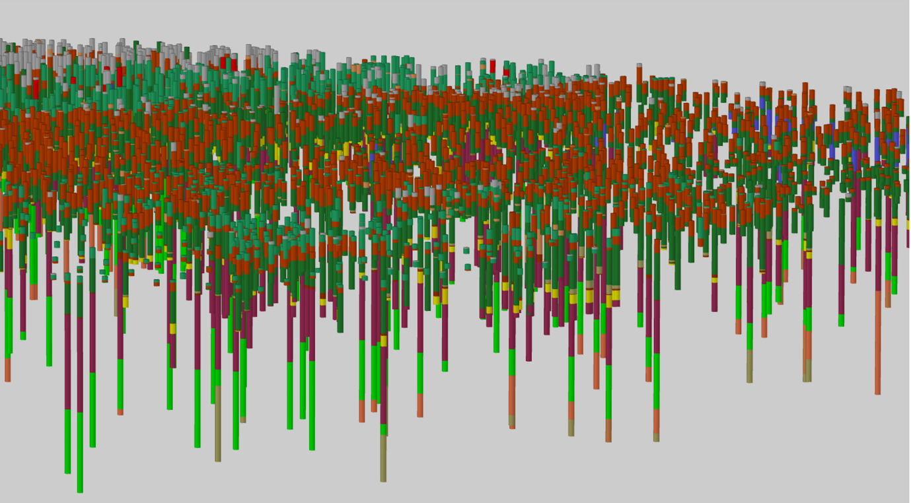
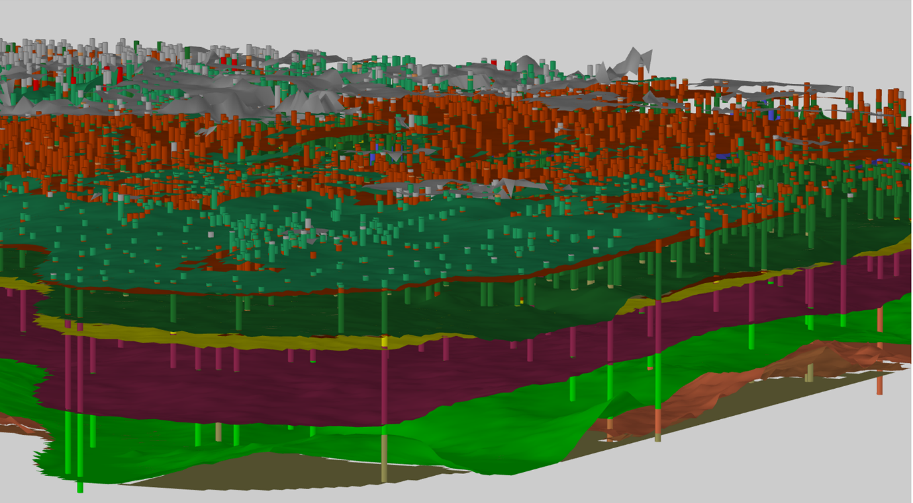

Ondergrondmodel GeoTOP
======================

Beschrijving
------------

GeoTOP is een registratieobject in het domein *modellen*. Het gaat in dit domein
om schattingen of voorspellingen van de opbouw en eigenschappen van de bodem of
ondergrond in twee of drie dimensies. Modellen zijn sterk afhankelijk van de
hoeveelheid en kwaliteit van de beschikbare ondergrondgegevens zoals
boormonsterbeschrijvingen. De kwaliteit van de modellen zal daarom toenemen
naarmate er meer ondergrondgegevens in de BRO beschikbaar komen.

GeoTOP is een driedimensionaal geologisch model van de laagopbouw en grondsoort
(bijvoorbeeld klei, zand, veen) van de ondiepe ondergrond van Nederland tot een
diepte van maximaal 50 m onder NAP. In GeoTOP is de ondergrond onderverdeeld in
een regelmatig driedimensionaal grid (raster) van aaneengesloten voxels
(volumecellen) van 100 x 100 m in de horizontale richtingen en 0,5 m in de
verticaal. Aan elke voxel zijn eigenschappen gekoppeld. Dit zijn de
lithostratigrafische c.q. geologische eenheid (laag) waartoe een voxel behoort,
de lithoklasse (grondsoort) die representatief is voor de voxel en een aantal
attributen die tezamen een maat van modelonzekerheid vormen. Behalve voxels
bevat GeoTOP ook een gedetailleerd lagenmodel en de geïnterpreteerde
boormonsterbeschrijvingen die bij het maken van het model gebruikt zijn.

De termen **lithostratigrafie**, **geologische eenheid** en **lithoklasse**
worden hieronder toegelicht:

-   **Lithostratigrafie** betekent het rangschikken van gesteentelagen in
    eenheden zoals formaties en laagpakketten op basis van lithologische
    kenmerken (waaruit bestaat het materiaal?), verbreiding (waar komt de
    eenheid voor?) en positie (wat is de ligging ten opzichte van andere
    eenheden?). Lithostratigrafische eenheden worden formeel gedefinieerd in de
    Stratigrafische Nomenclator van de Ondiepe Ondergrond van Nederland.

-   In GeoTOP wordt de term **geologische eenheid** gebruikt in plaats van
    lithostratigrafische eenheid omdat niet elke eenheid in het model één-op-één
    overeenkomt met een lithostratigrafische eenheid volgens de Nomenclator. Het
    kan namelijk voor de modellering nodig zijn om twee of meer
    lithostratigrafische eenheden samen te nemen tot één geologische eenheid. De
    tegenovergestelde situatie, waar een lithostratigrafische eenheid wordt
    gesplitst in een of meerdere geologische eenheden komt ook voor.

-   Lithologische kenmerken worden in GeoTOP weergegeven door middel van
    **lithoklassen**, waarin lithologie (grondsoort) en zandkorrelgrootteklassen
    zijn gecombineerd in één classificatie.

GeoTOP bestaat uit de volgende in de BRO opgenomen producten die ontstaan uit
een gestandaardiseerd werkproces:

-   De interpretatie van de boormonsterprofielen in **geologische eenheden** en
    in **lithoklasse-eenheden**. Elke boormonsterbeschrijving is onderverdeeld
    in intervallen van gelijke geologische eenheid. Daarbinnen zijn de
    intervallen verder opgedeeld in intervallen van een gelijke lithoklasse.

-   **Breuken**. Per breuksegment is aangegeven in welke basis van een
    geologische eenheid dit breuksegment nog invloed heeft.

-   Een **lagenmodel** waarbij de ondergrond is weergegeven als een stapeling
    van geologische eenheden die begrensd zijn door een top- en een basisvlak.
    Beide vlakken worden weergegeven als een **raster** met cellen van 100 x 100

    1.  Elke **rastercel** heeft de diepteligging van top respectievelijk basis
        in m onder NAP als attribuut. Uit de top- en basisrasters is een
        dikteraster afgeleid met de dikte van de geologische eenheid in m. Tot
        slot zijn er voor zowel top als basis standaarddeviatierasters
        beschikbaar die de modelonzekerheid van het lagenmodel representeren.

-   Een **voxelmodel** waarbij de ondergrond in voxels van 100 x 100 x 0,5 m
    ingedeeld is. Elke **voxel** heeft een aantal attributen, namelijk de
    geologische eenheid, de meest waarschijnlijke lithoklasse en een aantal
    attributen die tezamen een maat van modelonzekerheid vormen.

De onderlinge samenhang van de in de BRO opgenomen geïnterpreteerde
boormonsterbeschrijvingen, lagenmodel en voxelmodel is geïllustreerd in Figuur
3.1 – 3.3.

*Figuur 3.1: 3D weergave van boormonsterbeschrijvingen waarbij de kleuren
verschillende geologische eenheden weergeven.*

*Figuur 3.2: 3D weergave van een lagenmodel gebaseerd op de geïnterpreteerde
boormonsterbeschrijvingen van Figuur 3.1. Van het lagenmodel zijn alleen de
basisvlakken weergegeven. Elk basisvlak is het resultaat van een ruimtelijke
interpolatie van de in de boormonsterbeschrijvingen aangetroffen basissen van de
betreffende geologische eenheid.*

*Figuur 3.3: 3D weergave van het lagenmodel van Figuur 3.3 waarbij de kleuren in
de boormonsterbeschrijvingen nu de lithoklasse weergeven.*

*Figuur 3.4: 3D weergave van een voxelmodel waarbij de kleuren van de voxels de
lithoklasse weergeven. De lithoklasse indeling in de voxels is het resultaat van
een ruimtelijke interpolatie van de lithoklassen in de geïnterpreteerde
boormonsterbeschrijvingen binnen de verschillende geologische eenheden.*

Dekkingsgebied en modelgebieden
-------------------------------

Een belangrijk aspect van GeoTOP is dat het is opgedeeld in **modelgebieden**.
GeoTOP wordt niet in één keer landelijk samengesteld maar regio-gewijs
ontwikkeld. Ultimo 2018 bestreek GeoTOP circa 57% van het vasteland van
Nederland verdeeld over zeven modelgebieden. Van deze modelgebieden zijn er
initieel twee in de BRO opgenomen, dit zijn de modelgebieden *Westelijke Wadden*
en *Oostelijke Wadden* die tezamen circa 22% van Nederland beslaan. In de jaren
na 2018 zullen er meer modelgebieden aan de BRO worden toegevoegd zodat GeoTOP
uiteindelijk het hele vasteland van Nederland, inclusief de grote wateren zoals
het IJsselmeer, de Waddenzee en de Westerschelde, zal bestrijken.

Op GeoTOP is **versiebeheer** van toepassing. Het versiebeheer geldt zowel voor
individuele modelgebieden als voor GeoTOP als geheel. De in de BRO uitgeleverde
actuele versie van GeoTOP omvat alle op dat moment actuele modelgebieden.

De beheerder van een model maakt zijn waardenlijsten (codelijsten en/of
referentielijsten) bekend op een algemeen bekend formaat (PDF en als
downloadable bestand) en maakt deze toegankelijk via
www.basisregistratieondergrond.nl. De waardenlijsten worden waar mogelijk
meegeleverd bij de modellevering.

Als er wijzigingen zijn in een waardelijst, wordt er uiterlijk twee maanden vóór
inwerkingtreding een notificatie op die website gezet, zodat gebruikers nog tijd
hebben om hun eigen omgeving op de wijzigingen aan te passen.

Modelonzekerheden
-----------------

### Onzekerheid

De belangrijkste gegevensbron voor GeoTOP zijn boormonsterbeschrijvingen. Elk
van deze boormonsterbeschrijvingen geeft vaak gedetailleerde informatie over de
opbouw van de ondergrond op één specifieke locatie. Voor het overgrote deel van
de gridcellen en voxels geldt echter dat ze niet doorboord zijn. Dit betekent
dat we een schatting moeten doen op basis van de in de omgeving van de gridcel
of voxel aanwezige boormonsterbeschrijvingen. Hoe goed het model hiertoe in
staat is, is onder andere afhankelijk van:

-   de geologische complexiteit (de lithoklasse van een homogeen samengestelde
    eenheid is beter te schatten dan die van een heterogeen samengestelde
    eenheid);

-   de hoeveelheid en de kwaliteit van de boormonsterprofielen in de omgeving
    van de gridcel of voxel;

-   de aan het model opgelegde randvoorwaarden zoals verbreidingsgrenzen van
    geologische eenheden;

-   het gebruikte algoritme met de bijbehorende parameters zoals de gehanteerde
    ruimtelijke correlatiefunctie.

Alle maatstaven van onzekerheid in GeoTOP zijn gebaseerd op de in het model
gebruikte (stochastische) interpolatietechnieken. Het is belangrijk om te
beseffen dat deze technieken niet expliciet rekening houden met de
onzekerheidsmarges in de gebruikte brongegevens (waaronder de
boormonsterbeschrijvingen). In GeoTOP spreken we daarom van *modelonzekerheid*
in plaats van *onzekerheid*.

### Standaarddeviaties in het lagenmodel

Van elke gemodelleerde geologische eenheid in het lagenmodel is van zowel de top
als de basis een standaarddeviatieraster berekend. Deze rasters geven voor elke
rastercel de modelonzekerheid weer, uitgedrukt in de standaarddeviatie (in m)
van de door het model geschatte, meest waarschijnlijke diepteligging van de
gemodelleerde top en basis van de geologische eenheid. Met de standaarddeviatie
is het mogelijk om de kans te bepalen dat de diepteligging van de top of basis
een bepaalde afwijking vertoont van de door het model geschatte meest
waarschijnlijke waarde. De manier waarop de standaarddeviatie berekend wordt kan
per geologische eenheid en per modelgebied verschillen. Welke manier van
toepassing is wordt beschreven in het Totstandkomingsrapport dat met het model
in de BRO is opgenomen.

### Kans op lithoklasse

In het voxelmodel wordt de lithoklasse met behulp van stochastische
interpolatietechnieken geschat. Deze technieken komen er in essentie op neer dat
het model een groot aantal (bijvoorbeeld 100) keer wordt doorgerekend met
telkens een andere, maar statistisch gezien even waarschijnlijke, uitkomst. Voor
de lithoklasse van een voxel wordt dan bijvoorbeeld 80 keer klei geschat, 10
keer veen en 10 keer kleiig zand. Uit de verschillende schattingen wordt voor
elke lithoklasse de kans op voorkomen berekend door het aantal keren dat de
lithoklasse is geschat te delen door het aantal modelberekeningen (bijvoorbeeld
100). In het eerder beschreven voorbeeld is de kans op klei dan 0,8, de kans op
veen 0,1 en de kans op kleiig zand eveneens 0,1.

De verschillende uitkomsten van de modelberekeningen geven aan hoe goed het
model in staat is om een eenduidige schatting te geven: in het beste geval leidt
elke modelberekening tot dezelfde uitkomst, in het slechtste geval komen alle
mogelijke uitkomsten even vaak voor.

Voor individuele voxels kan de kansverdeling worden weergegeven in een
histogram, waarmee een visualisatie van de modelonzekerheid in de betreffende
voxel wordt verkregen (Figuur 3.5).

Figuur 1 Modelonzekerheid individuele voxel

*Figuur 3.5: Visualisatie van modelonzekerheid van een individuele voxel door
het weergeven van de kans op lithoklasse in een histogram. In dit voorbeeld is
de meest waarschijnlijke lithoklasse klei, met een kans van ruim 50%. Er is ook
een vrij grote kans op kleiig zand (\~30%), de kans dat de voxel zand of veen
bevat is echter klein.*

### Modelonzekerheid van lithoklasse

Naast de kans op lithoklasse bevat het voxelmodel een maat van modelonzekerheid
die in één getalswaarde wordt uitgedrukt in plaats van een reeks afzonderlijke
kansen voor elke mogelijke lithoklasse of geologische eenheid. Deze maat is
afgeleid van het concept van *informatie-entropie*. In plaats van de term
informatie-entropie wordt in GeoTOP de term *modelonzekerheid* gebruikt.

De modelonzekerheid van lithoklasse is de mate waarin het model in staat is om
een eenduidige schatting te geven van de voor de voxel representatieve
lithoklasse en heeft de volgende eigenschappen:

1.  Modelonzekerheid is 0 als elke modelberekening tot dezelfde geschatte
    lithoklasse leidt, ofwel er is één lithoklasse met kans 1, en alle andere
    lithoklassen hebben kans 0.

2.  Modelonzekerheid is 1 (maximale waarde) als alle mogelijke lithoklassen met
    dezelfde kans voorkomen. Het model kan dan geen eenduidige schatting geven
    van de lithoklasse van de voxel.

3.  Hoe meer mogelijke lithoklassen met een kans groter dan 0, hoe groter de
    modelonzekerheid.

4.  Hoe groter de verschillen tussen de kansen, hoe kleiner de modelonzekerheid.

*Voorbeelduitwerking*

In onderstaande tabel is de modelonzekerheid (H) uitgewerkt voor een model met
drie mogelijke lithoklassen (bijvoorbeeld zand, klei, veen, met kansen p1, p2,
p3).

In de eerste situatie is de kans op de eerste lithoklasse 1, en hebben de beide
andere lithoklassen een kans 0. Hieruit volgt dat het model zeer goed in staat
is om een schatting te geven en de modelonzekerheid is daarom 0.

In de tweede situatie zijn de kansen op de drie lithoklassen aan elkaar gelijk.
Het model is niet in staat om een eenduidige schatting te geven en de
modelonzekerheid is daarom 1.

In de derde situatie zijn er twee lithoklassen met gelijke kansen. Het model kan
geen eenduidige schatting geven van de eerste twee lithoklassen, maar
lithoklasse 3 komt zeker niet voor.

In de laatste situatie wordt een kleine kans op lithoklasse 3 (p3 = 0.02 of 2%)
geïntroduceerd waardoor de modelonzekerheid relatief sterk toeneemt.

### Modelonzekerheid van geologische eenheid

De modelonzekerheid van geologische eenheid is de mate waarin het model in staat
is om een eenduidige schatting te geven van de geologische eenheid waartoe de
voxel behoort. Net als de modelonzekerheid op lithoklasse is deze onzekerheid
afgeleid van het concept van *informatie-entropie* en heeft vergelijkbare
eigenschappen. Bij de berekening van de modelonzekerheid wordt gebruik gemaakt
van de standaarddeviaties van de top en de basis van de verschillende
geologische eenheden uit het lagenmodel.

Doel en gebruik
---------------

GeoTOP is een subregionaal ondergrondmodel met een gebruiksschaal die past bij
toepassingen op provinciaal, gemeentelijk of wijkniveau. Deze gebruiksschaal is
vergelijkbaar met de schaal van 1:50.000 die bij Geologische Kaart van
Nederland, een voorloper van GeoTOP, gehanteerd werd. Bij ondergrondvraagstukken
op een grotere schaal (straatniveau of individuele gebouwen) kan GeoTOP dienen
als raamwerk waarbinnen meer detail kan worden aangebracht.

Kwaliteitsaspecten
------------------

### Algemeen

De kwaliteit van GeoTOP is sterk afhankelijk van de volgende factoren:

De *hoeveelheid beschikbare boormonsterbeschrijvingen*. De gebruikte
boormonsterbeschrijvingen zijn niet gelijkmatig over Nederland verdeeld. Er zijn
gebieden met een zeer hoge boordichtheid, bijvoorbeeld Zuid-Holland en grote
delen van Midden-Nederland. Andere delen van het land, zoals de Veluwe, hebben
een veel lagere boordichtheid. Bovendien geldt dat de boordichtheid snel met de
diepte afneemt. In het algemeen kan gesteld worden dat de afnemende
datadichtheid dieper dan 30 m onder maaiveld leidt tot een sterk verminderde
kwaliteit van de schatting van de lithoklasse.

De *kwaliteit van de boormonsterbeschrijvingen*. De gebruikte
boormonsterbeschrijvingen zijn niet specifiek voor GeoTOP verzameld en de
kwaliteit loopt, afhankelijk van het doel en de methode waarmee ze gezet zijn,
sterk uiteen.

De *ouderdom van de brongegevens*. De te modelleren werkelijkheid zoals die in
boormonsterbeschrijvingen en op geologisch en bodemkundig kaartmateriaal is
weergegeven kan intussen zijn veranderd. Denk aan veen in een
boormonsterbeschrijving dat inmiddels is geoxideerd, vergravingen (havens,
vaargeulen), of zich verleggende geulsystemen in de Waddenzee.

De *complexiteit van de geologie*. Een eenvoudige, homogene ondergrond is
eenvoudiger en met minder boormonsterbeschrijvingen te modelleren dan een
complexe, heterogene ondergrond. Complexiteit kan regionaal verschillen,
daarnaast bestaan binnen een regio ook verschillen in de complexiteit van de
geologische eenheden die in de regio worden onderscheiden.

De *toepassing* waarin GeoTOP gebruikt wordt. Verschillende toepassingen stellen
verschillende kwaliteitseisen.

Deze en andere kwaliteitsaspecten wordt in de navolgende paragrafen verder
besproken.

### Aansluiting van modelgebieden

Zowel bij het construeren van nieuwe modelgebieden als bij het plegen van
onderhoud aan bestaande modelgebieden wordt gestreefd naar een zo goed mogelijke
onderlinge aansluiting van de modelgebieden. Desondanks kunnen zich op de
overgang van het ene modelgebied naar het andere aansluitingsproblemen voordoen.
Dit heeft te maken met de tijd die verstrijkt tussen het opleveren van het ene
en het andere modelgebied. In de verstreken tijd zijn meer
boormonsterbeschrijvingen verzameld, kan er een nieuwe versie van een
brongegeven beschikbaar zijn gekomen of zijn de geologische inzichten gewijzigd.
Ook kan de te modelleren werkelijkheid zijn gewijzigd, bijvoorbeeld het effect
van een zandwinning die in het ene modelgebied al zichtbaar is maar in het
andere, oudere modelgebied nog niet.

Aansluitingsproblemen zijn te herkennen aan onrealistische sprongen in de
diepteligging van de top of basis van een geologische eenheid en abrupte
overgangen in lithoklasse precies op de modelgebiedgrens. Het verdient daarom
aanbeveling om in de nabijheid van een modelgebiedgrens niet alleen het model
zelf, maar ook de geïnterpreteerde boormonsterbeschrijvingen aan weerszijden van
de grens te raadplegen. De grenzen van de modelgebieden zijn opgenomen in de
BRO.

### Boormonsterbeschrijvingen

#### Boormonsterbeschrijvingen

De inhoudelijke kwaliteit van de boormonsterbeschrijvingen is zeer wisselend. De
gebruikte boormethode en de daaraan gekoppelde manier van monstername oefent
invloed uit op de inhoudelijke kwaliteit van laagbeschrijvingen.
Booractiviteiten verstoren de aanwezige opbouw van de bodemlagen. Afhankelijk
van de boormethode treedt in grote of kleine mate vermenging op van de
verschillende grondsoorten. In een gestoken boring, waarbij een ongeroerd
bodemmonster voor iedere meter wordt genomen, gebeurt dit alleen bij de overgang
van de kernen. Maar tijdens een spoelboring vindt een sterke vermenging van de
lagen plaats. Bovendien kan de aan het boorwater toegevoegde boorspoeling de
kwaliteit van het monster nog verder doen dalen.

Ook de manier waarop de monsters zijn beschreven en de vakkundigheid van de
beschrijver spelen een belangrijke rol. Het besluit om de laagopbouw van een
boring al dan niet uitgebreid te beschrijven, hangt o.a. af van het doel van de
boring en de daarvoor beschikbare financiële middelen.

#### Kwaliteitsfiltering

Uitgangspunt voor GeoTOP is dat alle beschikbare boormonsterbeschrijvingen
worden meegenomen in de modellering. Voor een deel van de
boormonsterbeschrijvingen geldt echter dat de kwaliteit zodanig laag is, dat
GeoTOP er niet beter maar slechter door zou worden. Om deze
boormonsterbeschrijvingen te traceren en uit te sluiten wordt een
kwaliteitsfilter toegepast. Een eerste filter sluit boormonsterbeschrijvingen
uit waarvan alleen kopgegevens bekend zijn of waarvan de kopgegevens
maaiveldhoogte, einddiepte of locatie (x- en y-coördinaat) ontbreken.

Vervolgens worden alle boormonsterbeschrijvingen onderworpen aan een
geautomatiseerd uitgevoerde kwaliteitscontrole. Dit gebeurt door te kijken naar
de dikte van de intervallen in de eerste 30 m van de boormonsterbeschrijving.
(Een interval bevindt zich in de eerste 30 m als de top zich niet meer dan 30 m
onder het maaiveld van het boormonsterbeschrijving bevindt.) Van deze
intervallen wordt de maximale dikte en de gemiddelde dikte bepaald. Op basis van
ervaringscijfers worden boormonsterbeschrijvingen met een te groot maximaal
dikte-interval en/of een te groot gemiddeld dikte-interval uitgesloten. De
waarden van de maximaal toelaatbare dikte kan per modelgebied of geologische
regio verschillen.

Boormonsterbeschrijvingen die worden uitgesloten worden vastgelegd in een lijst
met uit te sluiten boornummers, met een (korte) omschrijving van de reden waarom
ze uitgesloten zijn. Deze lijst wordt in latere modelleerstappen op basis van
controles van het lagenmodel nog handmatig aangevuld. Afhankelijk van het
modelgebied wordt in het algemeen maximaal 10% van de boormonsterbeschrijvingen
op basis van het automatische kwaliteitsfilter uitgesloten.

#### Momentopname (ouderdom)

Boormonsterbeschrijvingen zijn een momentopname van de beschreven ondergrond. De
opbouw van de ondergrond ter plaatse van de boormonsterbeschrijving kan in de
tijd die verstreken is tussen het maken van de beschrijving en het construeren
van het model veranderd zijn. Denk aan veen in een boormonsterbeschrijving dat
inmiddels is geoxideerd, vergravingen (havens, vaargeulen), of zich verleggende
geulsystemen in de Waddenzee.

#### Momentopname (database)

Bij het construeren van een modelgebied wordt op een zeker moment een
momentopname (‘snapshot’) gemaakt van de brondatabase met
boormonsterbeschrijvingen en de bijbehorende
boormonsterbeschrijvingsintervallen. De interpretaties van de
boormonsterbeschrijvingen worden vervolgens gebaseerd op deze momentopname. Alle
wijzigingen die in de brondatabase na de momentopname worden aangebracht, zullen
daarom niet zichtbaar zijn in het betreffende modelgebied.

#### Interpretatie in geologische eenheden

Door de omvang van de dataset is het ondoenlijk alle boormonsterbeschrijvingen
handmatig te voorzien van een indeling in geologische eenheden. Bovendien
bestaat bij handmatige werkzaamheden het gevaar van inconsistentie waarbij
vergelijkbare boormonsterbeschrijvingen verschillend worden geïnterpreteerd.
GeoTOP voorziet daarom in geautomatiseerde procedures om de
boormonsterbeschrijving in geologische eenheden te interpreteren.

De interpretatie in geologische eenheden wordt door gebiedsdeskundige geologen
getoetst aan de hand van geologische dwarsdoorsneden en eerder met de hand
geïnterpreteerde boormonsterbeschrijvingen. Ook wordt een aantal
plausibiliteitscontroles uitgevoerd om een stratigrafisch correcte opeenvolging
van eenheden te waarborgen. Het is echter niet mogelijk om alle individuele
interpretaties handmatig te controleren.

#### Lithoklasse interpretatie

De lithoklasse-interpretatie van boormonsterbeschrijvingsintervallen is een
geautomatiseerd proces met relatief eenvoudige en eenduidige rekenregels.

### Verbreidingen

Voorafgaand aan de stratigrafische interpretatie van de
boormonsterbeschrijvingen wordt van elke geologische eenheid een verbreiding
vastgesteld. Deze verbreiding bakent het gebied af waarbinnen in het
constructieproces van GeoTOP de boormonsterbeschrijvingen onderzocht worden op
het voorkomen van de geologische eenheid. Tevens fungeert de verbreiding als de
maximale of potentiële verbreiding van het lagenmodel: buiten de potentiële
verbreiding komt de eenheid niet voor, binnen de verbreiding kan de eenheid
voorkomen.

Bij het construeren van verbreidingsgrenzen wordt een kaartschaal van circa
1:50.000 gehanteerd. Kleine voorkomens van de geologische eenheid die buiten de
resolutie van deze kaartschaal vallen, worden daardoor mogelijk niet in de
verbreiding opgenomen.

Ten behoeve van de lagenmodellering worden de verbreidingsgrenzen (polygonen)
verrasterd naar rasters met rastercellen van 100 x 100 m.

### Breuken

Binnen de modellering van GeoTOP wordt rekening gehouden met breuken. Per
breuksegment is aangegeven in welke basis van een geologische eenheid dit
breuksegment nog invloed heeft. Om modeltechnische redenen worden in de
modellering van de geologische eenheden van GeoTOP de breuken verondersteld
verticaal te zijn.

### Lagenmodel

#### Mate van detaillering

De mate van detaillering van het lagenmodel in het ondiepe bereik is in het
algemeen groter dan in de diepere delen. Dit heeft de maken met de
datadichtheid, die in het ondiepe bereik hoger is dan in het diepe deel.

#### Geostatistisch model

In het constructieproces van GeoTOP worden geostatistische procedures gebruikt
om de diepteligging van de basis van elke geologische eenheid te schatten.
Daarnaast wordt de standaarddeviatie van de basis als maat van modelonzekerheid
uitgeleverd. Het geostatistische karakter van het lagenmodel is terug te zien in
lokale variaties gesuperponeerd op een regionale trend.

#### Consistent lagenmodel

Het lagenmodel is consistent, dat wil zeggen dat de top van een eenheid ofwel
samenvalt met de basis van een of meerdere hoger gelegen eenheden, ofwel aan
maaiveld ligt. Omgekeerd valt de basis van een eenheid samen met een of meerdere
toppen van dieper gelegen eenheden, of de basis ligt aan de onderkant van het
model. Een logisch gevolg is dat elk willekeurig punt in de ruimte (binnen de
begrenzingen van het modelgebied) zich altijd tussen de top en basis van één
enkele geologische eenheid bevindt. Deze gevolgtrekking gebruiken we om van (de
middelpunten van) voxels te bepalen tot welke eenheid ze behoren.

Voor de consistentie geldt een uitzondering voor eenheden die een onderdeel
vormen van een andere, omhullende ‘moedereenheid’. Een punt in de ruimte ligt
dan zowel tussen de top en basis van die eenheid als tussen de top en basis van
de omhullende moedereenheid. In het voxelmodel geldt deze uitzondering niet: een
voxel krijgt altijd 1 geologische eenheid toegekend.

#### Verschillen tussen lagenmodel en boormonsterbeschrijvingen

Een geïnterpreteerde boormonsterbeschrijving geeft veelal een gedetailleerd
beeld van de diepteligging en dikte van geologische eenheden op één specifieke
puntlocatie. In het lagenmodel wordt een schatting gegeven van de diepteligging
en dikte van geologische eenheden die representatief is voor een gebied van 100
x 100 m (10.000 m2) en die past bij een (sub)regionale schaal. De diepteligging
en dikte van geologische eenheden in een boormonsterbeschrijving kan daarom
afwijken van de diepteligging en dikte van geologische eenheden in het
lagenmodel op dezelfde locatie. Ook geldt dat de stratigrafische opeenvolging
van eenheden in een boormonsterprofiel kan afwijken van de gemodelleerde
opeenvolging van de eenheden: dunne eenheden kunnen weggeschaald zijn in het
lagenmodel en een complexe afwisseling van eenheden kan voor de modellering zijn
vereenvoudigd.

De hoogte van het maaiveld op de locatie van het boormonsterbeschrijving kan
eveneens afwijken van de maaiveldhoogte van het model. Dit kan verschillende
oorzaken hebben, zoals kleine hoogteverschillen ter plaatse van het
boormonsterbeschrijving, fouten in de opname van de maaiveldhoogte of een
daadwerkelijke verandering in maaiveldhoogte door bijvoorbeeld afgraving of
ophoging die in de tijd tussen het maken van het boormonsterbeschrijving en het
construeren van het model heeft plaatsgevonden. Verder geldt ook bij
maaiveldhoogte dat de hoogte in het model representatief is voor een gebied van
100 x 100 m en de hoogte van een boormonsterbeschrijving geldt voor één
specifieke puntlocatie.

### Voxelmodel

#### Stochastisch model

Bij het construeren van het voxelmodel wordt een stochastische
interpolatietechniek gebruikt om de lithoklasse van de voxels te schatten. De
procedure leidt tot een set van bijvoorbeeld 100 verschillende, maar statistisch
gezien even waarschijnlijke schattingen. Via een speciaal daarvoor ontwikkelde
methode worden de lithoklassen gemiddeld tot de ‘meest waarschijnlijke
lithoklasse’. Daarnaast wordt voor elke lithoklasse de kans op voorkomen
berekend door het aantal keer dat in een voxel de lithoklasse geschat is te
delen door het aantal schattingen.

#### Verschillen tussen voxelmodel en lagenmodel

Het voxelmodel heeft in de horizontale richtingen dezelfde dimensies als het
lagenmodel. In de verticale richting heeft het voxelmodel echter een maximale
resolutie van 0,5 m. Dit betekent dat waarden van top, basis en dikte van de
geologische eenheden in het voxelmodel altijd veelvouden van 0,5 m zijn.

Bij het vertalen van het lagenmodel naar het voxelmodel wordt voor het
middelpunt van de voxel bepaald in welke geologische eenheid hij valt. Deze
eenheid wordt vervolgens aan de voxel toegewezen. Op plaatsen waar een eenheid
in het lagenmodel dunner is dan 0,5 m, en er geen voxel-middelpunt tussen top en
basis ligt, zal de eenheid niet in het voxelmodel voorkomen. Als er juist wel
een voxel-middelpunt tussen top en basis ligt, zal de eenheid een overdreven
dikte krijgen van 0,5 m.

In uitzonderingsgevallen wordt ervoor gekozen om een eenheid in het lagenmodel
een minimale dikte van 0,5 m te geven. Daarmee wordt gewaarborgd dat de eenheid,
daar waar die in het lagenmodel voorkomt, ook in het voxelmodel wordt
gerepresenteerd.

#### Verschillen tussen voxelmodel en boormonsterbeschrijvingen

Net als bij het lagenmodel kunnen er verschillen bestaan tussen de lithoklassen
in het boormonsterbeschrijving en die in het voxelmodel. De lithoklassen in het
voxelmodel zijn een schatting die representatief is voor een volume van 100 x
100 bij 0,5 m (5.000 m3) en die past bij een (sub)regionale schaal.

Metadata
--------

### Resolutie

Rastercellen in het lagenmodel hebben afmetingen van 100 x 100 m. Voxels in het
voxelmodel meten 100 x 100 m in de horizontale richtingen en 0,5 m in de
verticale richting.

### Gebruiksschaal

Nabij het aardoppervlak heeft GeoTOP een gebruiksschaal van circa 1:50.000. Door
de afnemende datadichtheid met de diepte geldt op grotere dieptes een kleinere
gebruiksschaal. Door verschillen in datadichtheid zijn er daarnaast regionale
verschillen in de gebruiksschaal van het model. Zie ook de toelichting in 5.4.

### Gebiedsaanduiding

De omgrenzende rechthoek, uitgedrukt in minimale en maximale coördinaten van het
model, is vastgesteld in het Rijksdriehoekstelsel (RD). De waarden zijn in
onderstaande tabel weergegeven, met daarbij de omgerekende waarden in WGS84.

| **Coördinaat**         | **Rijksdriehoekstelsel (m)** | **WGS84 (graden)** | **WGS84 (decimale graden)** |
|------------------------|------------------------------|--------------------|-----------------------------|
| Minimale X- coördinaat | 0                            | E 003 11 40.7450   | 3.19465                     |
| Minimale Y- coördinaat | 300.000                      | N 50 40 09.1109    | 50.66920                    |
| Maximale X- coördinaat | 280.000                      | E 007 16 30.7336   | 7.27520                     |
| Maximale Y-coördinaat  | 625.000                      | N 53 35 46.3216    | 53.59620                    |

### Horizontale begrenzing

De horizontale begrenzing is zowel voor het model als geheel als voor elk
modelgebied afzonderlijk vastgelegd in een polygoon.

### Verticale begrenzing

De verticale begrenzing aan de bovenkant wordt bepaald door het maaiveld- en
waterbodemhoogtebestand. Dit bestand is een raster met cellen van 100 x 100 m en
vormt een onderdeel van het modelgebied. Elke rastercel geeft de hoogteligging
van het maaiveld resp. de waterbodem ten opzichte van NAP weer.

Voor het lagenmodel geldt dat de verticale begrenzing aan de onderkant wordt
bepaald door de basis van de diepst gelegen eenheden. Voor het voxelmodel geldt
dat de onderkant van de diepst gelegen voxel nooit dieper ligt dan 50 m onder
NAP.

### Horizontaal referentiesysteem

Alle coördinaten in GeoTOP zijn gegeven in m in het Rijksdriehoekstelsel (RD).

Voor de geïnterpreteerde boormonsterbeschrijvingen geven de coördinaten de
ligging van de boorlocatie aan maaiveld aan. Voor het lagenmodel geldt de
conventie dat de ligging van een rastercel wordt beschreven door de coördinaten
van de linkeronderhoek (“lower left corner”). Voor het voxelmodel geldt de
conventie dat de horizontale ligging van een voxel wordt beschreven door de
coördinaten van het middelpunt (“cell center”) van de voxel.

### Verticaal referentiesysteem

Alle hoogten in het lagenmodel en voxelmodel van GeoTOP zijn gegeven in m ten
opzichte van NAP. Voor het voxelmodel geldt de conventie dat de verticale
ligging van een voxel wordt beschreven door de coördinaten van het middelpunt
(“cell center”) van de voxel.
